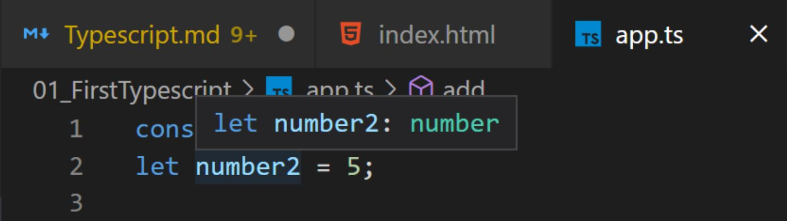
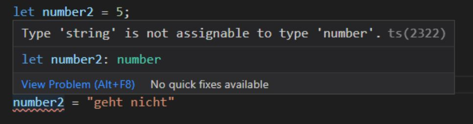
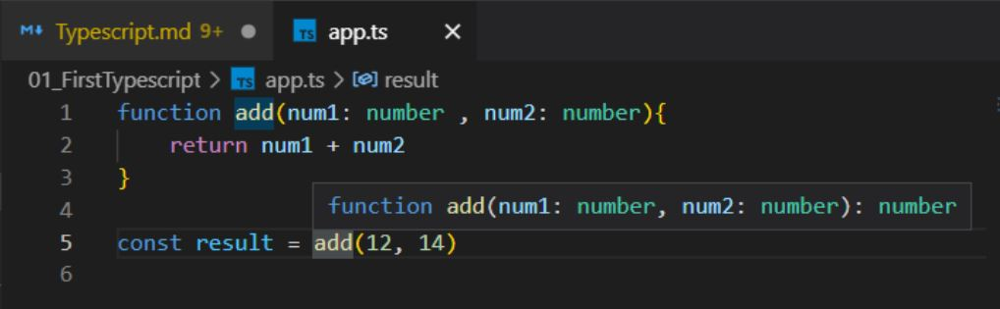
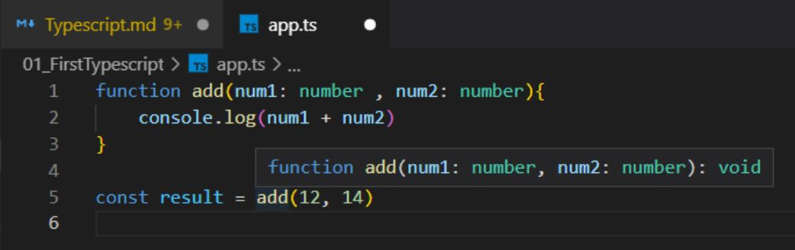
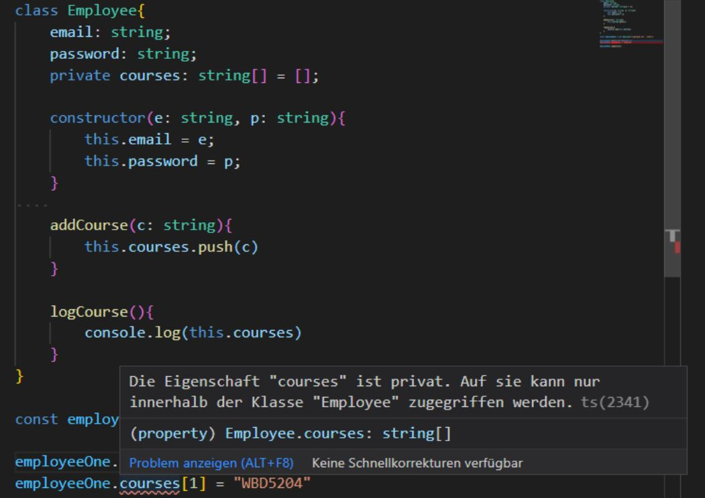
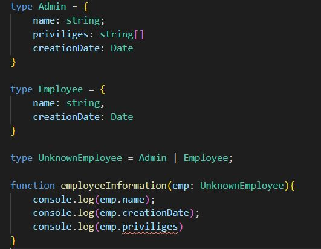
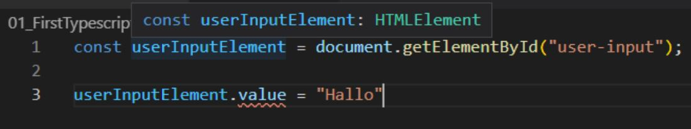
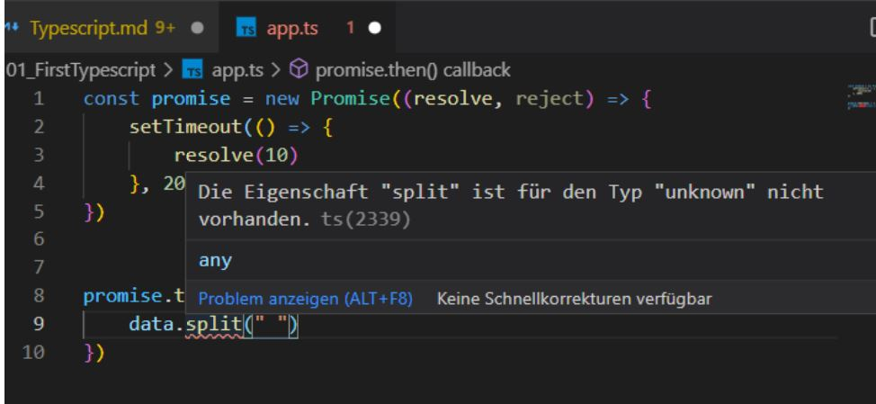
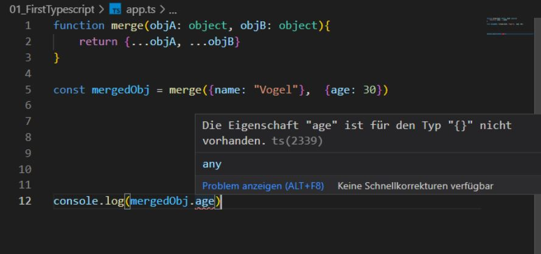

# Typescript:
### Inhaltsverzeichnis:
  - [Vorwort](#vorwort)
  - [Typescript Installation](#typescript-installation)
  - [Types](#types)
  - [Type Inference](#type-inference)
  - [Union Type](#union-type)
  - [Literal Types](#literal-types)
  - [Type Aliases](#type-aliases)
  - [Tuples](#tuples)
  - [Enum](#enum)
  - [Return Types](#return-types)
  - [Klassen](#klassen)
  - [Abstrakte Klassen](#abstrakte-klassen)
  - [Interface](#interface)
  - [Type Guards](#type-guards)
  - [Discriminated Unions](#discriminated-unions)
  - [Type Casting](#type-casting)
  - [Function Overloads](#function-overloads)
  - [Generics](#generics)
  - [Generic Functions](#generic-functions)
  - [Constraints](#constraints)

## Vorwort
Typescript ist eine Alternative zu Javascript, welche es ermöglicht strikte Typisierung im Programmiercode zu verwenden. Zudem ermöglicht es die Verwendung von generics, interfaces, tuples etc. \
Jedoch gilt es zu beachten, dass Typescript nicht von einem Browser ausgeführt werden kann. Daher muss Typescript vor der Benutzung in Javascript Kompiliert werden. \
\
**Merke:** Typescript hilft uns dabei besseren und performanteren Code zu schreiben. Für die Benutzung muss dieser jedoch in Javascript kompiliert werden.

## Typescript Installation:
Für die Kompilierung von Typescript zu Javascript muss dieses erst einmal installiert werden. \
Über die Eingabe `npm install -g typescript` im Terminal kann TS global installiert werden. Der Befehl `tsc --version` gibt an welche Version von TS auf dem Betriebssystem installiert wurde. \
Über cd (change directory) kann nun in das gewünschte Verzeichnis Navigiert werden in welcher eine TS Datei abliegt (index.ts). Der Aufruf `tsc index.ts` kompeliert nun die Datei in valides Javascript.\
Über den Befehl ` tsc index.ts --watch` wird der Typescript File automatisch überwacht und bei jedem Speichervorgang geupdatet.


## Types:
Im folgenden Beispiel wird ein Funktionskörper add definiert.
Dieser akzeptiert zwei Parameter ``num1`` und`` num2`` welche nun mit type safety versehen werden können. Der Funktionsaufruf ``add`` akzeptiert fortan nur noch Parameter vom Typen number. Sollte ein anderer Parameter Typ übergeben werden, wirft Typescript einen Fehler.

```typescript
    const number1 = 1;
    const number2 = 5;

    function add(num1: number, num2: number){
        return num1 + num2;
    }

    const result = add(number1, number2);
    console.log(result)
```
Natürlich versteht TS auch alle anderen Datentypen als Types. 
- number
- string
- boolean
- null
- undefined
- object
- array
- any (Der any Type, steht repräsentativ für alle Types. Er entspricht automatisch den Default Einstellungen von Javascript)

## Type Inference:
In dem Beispiel des vorherigen Kapitels fällt auf, dass lediglich den Parametern ein Type zugewiesen wurde. Eine Typezuweisung bei den Variablen ist nicht notwendig, da TS über eine mitgelieferte Type Inference verfügt. Das bedeutet, dass die Werte von den Variablen automatisch durch Typrescript erkannt werden.


**Achtung:** Im Umkehrschluss bedeutet dies aber auch, dass der Type einer Variablen nicht ohne weiteres geändert werden darf. Auch wenn das in klassischem Javascript möglich wäre.


## Union Type:
Im Beispiel oberhalb ist es nicht möglich den Type einer Variablen zu ändern. Wenn dies aber ausdrücklich erwünscht ist, können Union Types weiterhelfen. So ist es möglich bei der Variablen Deklaration anzugeben, dass sowohl Werte vom Type number als auch vom Type string akzeptiert werden. 
```typescript
let number2: number | string = 12;

number2 = "Hallo"
```
## Literal Types:
Einem Parameter oder einer Variablen können auch feste Werte zugewiesen werden. Dies geschieht mithilfe der so genannten Literal Types. Im Beispiel unterhalb darf die Variable ``number2`` entweder eine beliebige Zahl oder einen String vom Wert "Hallo" speichern. Alle anderen Stringwerte wären für diese Variable nicht gestattet.
```typescript
let number2: number | "Hallo" = 12;

number2 = "Hallo"
```
## Type Aliases:
Union Types können mit der Hilfe von Type Aliases zusammengefasst und abgespeichert werden. Im Beispiel unterhalb wurde ein neuer Type Aliase ``StringOrNumber`` definiert und kann nun wiederverwendet werden.
```typescript
type StringOrNumber = string | number

let number2: StringOrNumber = 12;
```
## Tuples:
Tuples sind dann praktisch wenn man nicht nur die Type Werte eines Arrays, sondern auch dessen exakte Länge bestimmen möchte.
Die Tupel im Beispiel unterhalb gibt an, dass es sich um ein Array mit den Werten number und string handelt. Die länge des Arrays wird hierbei auf zwei Werte beschränkt.
```typescript
let user: [number, string] = [1, "Steve"];

//Das würde in TS einen Fehler Werfen
user[2] = "hallo"
```
## Enum:
Mit einer Enum können Nummern ein Label zugewiesen bekommen.
Die Nummer kann nun über das Label aufgerufen werden. Der Vorteil hierbei ist, dass die Lesefreundlichkeit durch das Label erhöht wird. Im Beispiel unterhalb wird dem role key die Zahl 0 zugewiesen
```typescript
enum Role {ADMIN, READ_ONLY, AUTHOR}

let user = {
    email: "j.vogel@sae.edu",
    password: "12345",
    role: Role.ADMIN
}
```

## Return Types:
Hinter den Klammern einer Funktion wird mithilfe eines Doppelpunktes der return Wert angegeben. In diesem Beispiel handelt es sich um einen return Wert vom Type number.

Wenn die Funktion keinen Rückgabewert hält, zum Beispiel bei einem ``log`` Befehl, wird dies über void angegeben.

**Merke:** Eine Funktion kann auch als Type angegeben werden. Dies kann nützlich sein, wenn eine Variable später eine spezielle Funktion halten soll
```typescript
function add(num1: number , num2: number){
    return num1 + num2
}

let addition: (a: number, b: number) => number;

addition = add;
```

## Klassen:
Im folgenden Beispiel wurde ein Klasse `Employee` erstellt.
Die Klasse hält eine Methode ``addCourse`` um einem Mitarbeiter einen Kurs zuzuteilen. Ebenso existiert eine Methode ``logCourse ``um sich das Array mit allen Kursen ausgeben zu lassen.
```typescript
class Employee{
    email: string;
    password: string;
    courses: string[] = [];

    constructor(e: string, p: string){
        this.email = e;
        this.password = p;
    }
    
    addCourse(c: string){
        this.courses.push(c)
    }

    logCourse(){
        console.log(this.courses)
    }
}

const employeeOne = new Employee("vogel@web.de", "1234");

employeeOne.addCourse("WBD4300")
employeeOne.logCourse()
```
In diesem Beispiel wäre es jedoch möglich den key ``courses`` direkt zu manipulieren. \
Im Beispiel unterhalb wird direkt ein neuer Wert in das Array ``courses`` gegeben. Die ``addCourse`` Methode wird hierbei übersprungen.
 ```typescript

employeeOne.courses[1] = "WBD5204"
employeeOne.logCourse()
```
Wenn dies nicht erwünscht ist, können die Access Modifier ``public`` und ``private`` weiterhelfen. \
Bei Default sind die Klassen keys auf ``public`` gesetzt. Das bedeutet, dass diese auch außerhalb der Klasse verwendet werden dürfen. 
Der Modifier ``private`` hingegen gibt an, dass der key nur innerhalb einer Klasse verwendet werden darf. \
Im Beispiel Unterhalb wurde ``courses`` auf ``private`` gesetzt. Nun kann der Key nicht mehr direkt manipuliert werden. \
Wenn in der Klasse ``Employee`` der key ``courses`` auch für Kind Klassen zugänglich sein soll kann mit dem ``protected`` Modifier gearbeitet werden.

**Merke:** Neben private und public gibt es noch den readonly Modifier. Dieser erlaubt nur das Setzten in der Initialisierung. Eine spätere Änderung ist ausgeschlossen.
 ```typescript
class Employee{
    private readonly id: string; 
    email: string;
    password: string;
    private courses: string[] = [];

    constructor(id: string, e: string, p: string){
        this.id = id;
        this.email = e;
        this.password = p;
    }
}
```
## Abstrakte Klassen:
Abstrakte Klassen können dazu verwendet werden Kindklassen zu definieren.\ 
**Merke:** Klassen mit dem Keyword `abstract` können nicht initialisiert werden (`new Employee()`). Stattdessen kann nun in ihnen eine oder mehrere Abstrakte Methoden definiert werden.\
Diese geben nur den Namen und den zu erwartenden Rückgabewert an (` abstract returnUserInfo(): {email: string, password:string} `). \
Sollte eine Kindklasse die Abstrakte Methode nicht beinhalten, würde jetzt ein Fehler geworfen werden.
 ```typescript
abstract class Employee{
    protected readonly id: string; 
    email: string;
    password: string;
    protected courses: string[] = [];

    constructor(id: string, e: string, p: string){
        this.id = id;
        this.email = e;
        this.password = p;
    }
    
    addCourse(c: string){
        this.courses.push(c)
    }

    logCourse(){
        console.log(this.courses)
    }

    abstract returnUserInfo(): {email: string, password:string}
}

class Supervisor extends Employee{
    constructor(id: string, email: string, password: string){
        super(id, email, password)
    }
    returnUserInfo(){
        return {
            email: this.email,
            password: this.password
        }
    }
}

const employeeOne = new Supervisor("01", "vogel@web.de", "1234");

employeeOne.returnUserInfo()
```

## Interface:
Ein Interface kann dafür verwendet werden, um Objekte genauer zu beschreiben. Wenn ein Objekt nicht der Struktur des Interfaces folgt, wird ein Fehler ausgegeben.
 ```typescript
interface Role {
    roleName: string,
    canCreateRoles: boolean,
    CreateEmployeeByRole: string[]
    employees: string[]
}

let role: Role;

role = {
    roleName: "Admin",
    canCreateRoles: true,
    CreateEmployeeByRole: ["Admin", "Author", "Supervisor"],
    employees: ["192546546", "456547546543", "436543543"]
}
```
Doch wo liegt der Unterschied zwischen `type` und `interface`? 
Interfaces können direkt in Klassen Implementiert werden, wie das Beispiel unterhalb aufzeigt.
 ```typescript
interface RoleInterface {
    roleName: string,
    canCreateRoles: boolean,
    createEmployeeByRole: string[]
    employees: string[]
}

class Role implements RoleInterface{
    roleName;
    canCreateRoles;
    createEmployeeByRole;
    employees;

    constructor(roleName: string, canCreateRoles: boolean, createEmployeeByRole: string[], employees: string[]){
        this.roleName = roleName;
        this.canCreateRoles = canCreateRoles;
        this.createEmployeeByRole = canCreateRoles;
        this.employees = employees;
    }
}
```
## Type Guards:
Im folgenden Beispiel wurden drei Typen Definiert. ``Admin``, ``Employee`` und ``UnknownEmployee`` welcher entweder vom Type Admin oder vom Type Employee ist.
Die Funktion ``employeeInformation`` erwartet einen Parameter vom Type ``UnknownEmployee``.\
Daher kann in der Funktion ``emp.name`` und ``emp.creationDate`` ausgelesen werden, da diese in beiden Types vorhanden sind. Der key ``priviliges`` ist jedoch nur im Type `` Admin`` vorhanden. Aus diesem Grund kann ``emp.priviliges`` nicht ausgelesen werden.


In diesem Fall muss zur Absicherung Type Guards angewendet werden. So kann über einen `if` Statement abgefragt werden ob der Parameter `emp` den key `priviliges` beinhaltet oder nicht.
 ```typescript
function employeeInformation(emp: UnknownEmployee){
    console.log(emp.name);
    console.log(emp.creationDate);
    if("priviliges" in emp){
        console.log(emp.priviliges)
    }   
}
```
Ein weiteres Beispiel für Type Guards kann unterhalb entnommen werden.
 ```typescript
class Unicorn {
    poopRainbows(){
        console.log("unicorn poops Rainbow")
    }
}

class Smurf {
    doSomeMushroomThing(){
        console.log("smurf doing that smurf thing")
    }
}

type MythicalCreatures = Unicorn | Smurf

const unicorn = new Unicorn();
const smurf = new Smurf();

function handleCreatures(creature : MythicalCreatures){
    if(creature instanceof Unicorn){
        creature.poopRainbows()
    }
}
```
## Discriminated Unions:
Discriminated Unions sind ein besonderer Type des Type Castings.
Die Klassen aus dem Beispiel oberhalb wurden durch interfaces ersetzt. Der ` instanceof ` Operator kann in diesem Beispiel also nicht eingesetzt werden. Der Funktionsaufruf ` handleCreatures ` muss aber dennoch beide Interfaces voneinander unterscheiden können.
Dies kann über Discriminated Unions gehandelt werden. Dem jeweiligen Interface, wird ein einmaliger `type` übergeben. Dieser kann nun im switch case statement ausgelesen werden.
 ```typescript
interface Unicorn {
   type: "unicorn" 
   poopRainbow: string
}

interface Smurf {
    type: "smurf"
    doMushroom: string
}

type MythicalCreatures = Unicorn | Smurf


function handleCreatures(creature : MythicalCreatures){
    switch(creature.type){
        case "smurf":
            console.log(creature.doMushroom)
            break;
        case "unicorn":    
            console.log(creature.poopRainbow)
            break;
    }
}
```

## Type Casting:
Im Beispiel unterhalb wird über ` document.getElementById(„user-input“); ` auf ein HTML input Element referenziert. 
Typescript kann hier zwar erkennen, dass es sich um ein HTML Element handelt, allerdings weiß es nicht welches Element sich hinter der id ` user-input` verbirgt. Da nicht jedes beliebige HTML Element das `value` Argument beinhaltet kann nun auf dieses nicht zugegriffen werden.

Typecasting wird also benötigt um TS mitzuteilen um welches Element es sich tatsächlich handelt. Ein Beispiel unterhalb zeigt auf wie Typecasting angewandt wird.
 ```typescript
const userInputElement = <HTMLInputElement>document.getElementById("user-input");

userInputElement.value = "Hallo"
```

## Function Overloads:
Im Beispiel unterhalb wird eine `add` Funktion ausgegeben. Das Problem das hierbei besteht ist, dass `add` immer den Type `StringOrNumber` als return Wert hält. Über Function Overloads kann nun angegeben werden, unter welchen Voraussetzungen ein string oder eine number zurückgegeben wird. Daher kann nun auf die Varaible `result` die `split` Methode ausgeführt werden.
 ```typescript
type StringOrNumber = string | number;

function add(a:string, b:string): string
function add(a: number, b:number): number
function add(a: StringOrNumber, b:StringOrNumber){
    if(typeof a === "string" || typeof b === "string"){
        return a.toString()+ " " + b.toString()
    }
    return a + b
}

const result = add("Vogel", "Julian");
result.split(" ");
```
## Generics:
Um zu verstehen was generics genau sind, wird hier ein Beispiel anhand eines Promises dargestellt. Im Beispiel unterhalb ist ersichtlich, dass die Variable `promise` einen Rückgabewert von `Promise<unknown>` hält. Dies hat jedoch zur Folge, dass die Methode `split` im `then` Block nicht aufgerufen werden kann.

Mit hilfe von Generics kann nun angegeben werden, welche Werte das Promise halten soll.
 ```typescript
const promise: Promise<string> = new Promise((resolve, reject) => {
    setTimeout(() => {
        resolve("HEy ich bin ein String")
    }, 2000)
})


promise.then(data => {
    data.split(" ")
})
```
## Generic Functions:
In dem Beispiel unterhalb erwartet der Funktionskörper `merge` zwei Parameter vom Type `object`. Diese Werden innerhalb des Funktionskörpers in einem Objekt zusammengeführt und zurückgegeben. Die Variable `mergeObj` hält nun den Rückgabewert des Funktionsaufrufes. Dennoch kann auf den key `age` nicht zugegriffen werden.


Dies liegt daran das TS informiert ist, dass es sich zwar um einen Rückgabewert von `object` handeln muss. Allerdings kann TS nicht die Werte und Keys des Objektes erahnen. \
Natürlich kann uns hier auch Typecasting weiterhelfen 
```typescript
const mergedObj = <{name: string, age: 30}>merge({name: „Vogel“},  {age: 30})
 ```
oder 
```typescript
const mergedObj = merge({name: „Vogel“},  {age: 30}) as {name: string, age: number}
 ```
Allerdings möchten wir die `merge` Methode öfters verwenden und Generics bieten hier eine elegantere Alternative.
```typescript
function merge<T, U>(objA: T, objB: U){
    return {...objA, ...objB}
}

const mergedObj = merge({name: "Vogel"},  {age: 30});

const mergedObj2 = merge({something: "Noting"},  {spinn: 150});


console.log(mergedObj.age)

console.log(mergedObj2.something)
 ```
Mit den Generic Types von `T` und `U` wird nun angegeben um welchen Object Type es sich in den Parametern genau handelt. 
Daher kann nun auf `mergedObj` der key `age` aufgerufen werden.

## Constraints:
In dem Beispiel oberhalb wurden den Parametern ein Generic Type zugewiesen. Allerdings könnte nun dem Funktionsaufruf auch ein Parameter vom type number oder string übergeben werden. Mit Constrains ist es möglich dem Generic Type eine genaue Type Definition zu geben.
```typescript
function merge<T extends object, U extends object>(objA: T, objB: U){
    return {...objA, ...objB}
}

const mergedObj = merge({name: "Vogel"},  {noodle: "rice"});

const mergedObj2 = merge({something: "Noting"},  {spinn: 150});


console.log(mergedObj.name)

```
Der `keyof` Constraint kann beispielsweise dazu verwendet werden  den key eines weiteren Generic Types zu übergeben. Ein Beispiel kann unterhalb entnommen werden.
```typescript
function extract<T extends object, U extends keyof T>(obj: T, key: U){
    return "Value " +  obj[key]
}

extract({name: "Vogel", age: 33}, "name")
```